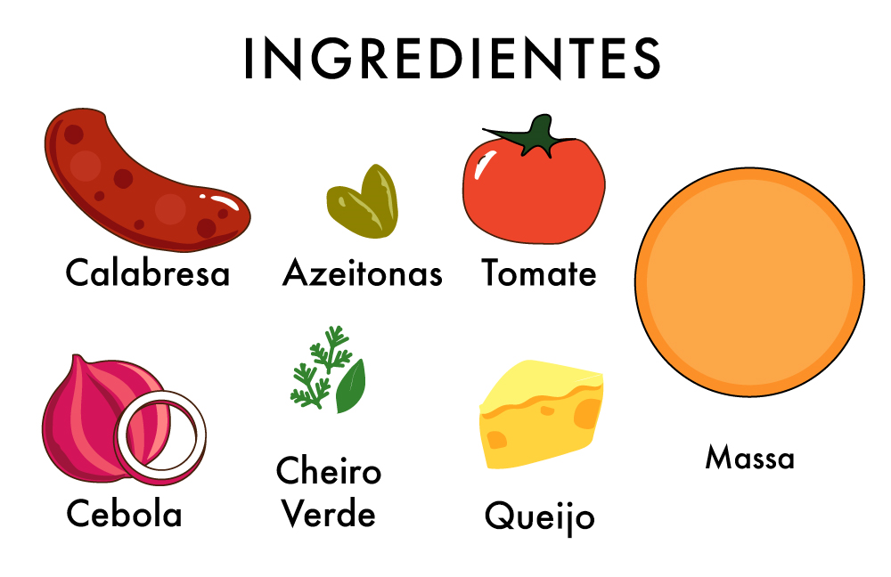
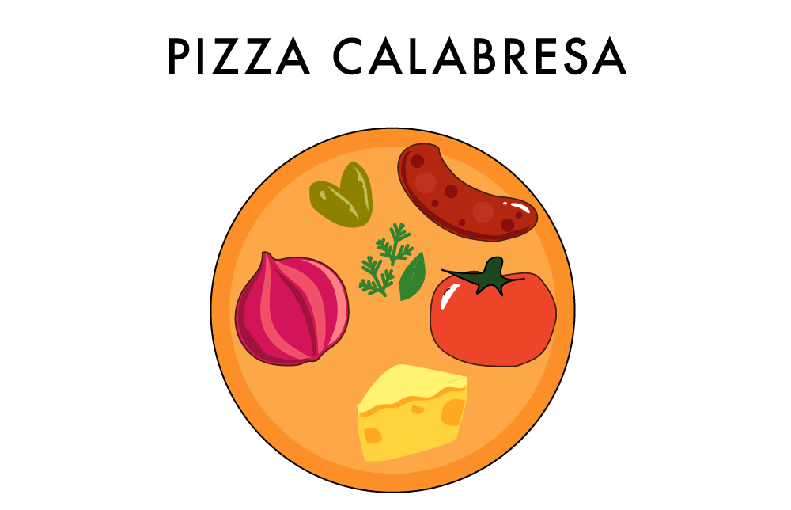
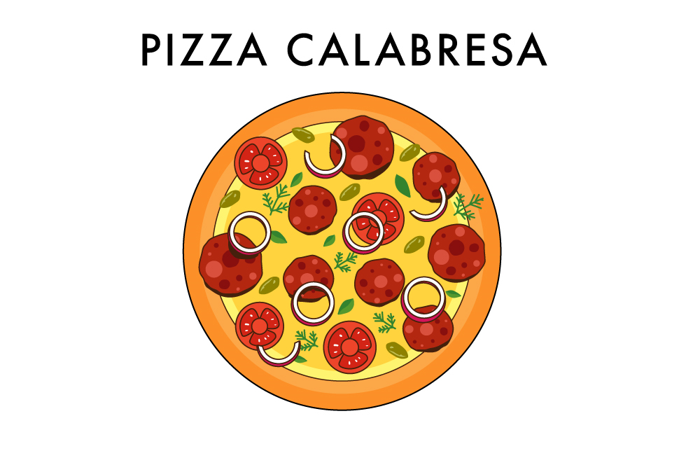
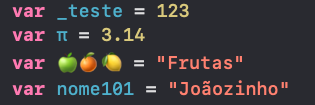

## Entendendo a proposta

Ao longo dos proximos dias, estarei escrevendo uma série de posts que acredito que podem ajudar no aprendizado do basico para futuros desenvolvedores. Através de exemplos e exercícios, mostrarei como é possivel conectar as ideias de forma a resolvermos problemas mais complexos com o computador.


## Mas afinal, o que são algorítimos?

Muto se fala sobre algorítimos, mas na prática, nem sempre esse termo é explicado e é claro. O termo algoritmo refere-se a uma sequência de instruções bem definidas para chegarmos a um objetivo. Como uma “sequência bem definida de instruções”, devemos entender instruções claras que podem ser facilmente entendidas por quem vai executá-las e em uma ordem bem estabelecida. Apesar do termo algoritmo ser muito utilizado na matemática e computação, ele está presente em muitas atividades do nosso dia a dia. Toda vez que executamos algum processo que pode ser repetido através de um conjunto de instruções como trocar o pneu de um carro, dar o nó em uma gravata, cozinhar um prato utilizando uma receita, tocar uma música utilizando uma partitura ou cifras, estamos executando um algoritmo.

Quando nos referimos aos computadores, vale ressaltar que apesar de possuirem uma grande capacidade em processar e calcular grandes volumes de informação de forma muito rápida, para realizar qualquer tarefa, por mais simples que seja, é preciso que sejam atribuídos a eles um conjunto de operações que eles consigam compreender. Cabe, portanto, à capacidade de raciocínio humana indicar ao computador quais instruções devem ser efetuadas, e em qual ordem, para que ele processe as informações disponíveis de forma útil e adequada, ou seja, devemos informar qual algoritmo o computador deve executar para atingir o que desejamos. O que chamamos de programa é, portanto, um algoritmo escrito em uma linguagem que o computador consiga entender.

A palavra lógica se origina da palavra grega logos, que significa conhecimento, pensamento. Podemos traduzir lógica como a arte de pensar de forma correta e bem estruturada. Quando nos referimos à lógica de programação, estamos falando da estruturação de nossas ideias com o objetivo de resolver um problema utilizando o computador como ferramenta.

Quando pretendemos fazer isto, devemos entender o problema que queremos resolver, dividi-lo em problemas menores até chegarmos a problemas que sabemos e conseguimos resolver, ou melhor, em problemas que sabemos mostrar ao computador como ele deve resolver. Por fim, devemos unir as soluções destes pequenos problemas (sempre que possível utilizando o computador para isto) para finalmente chegarmos à solução do problema original.

### O que é um programa?

Um programa é um conjunto de instruções, também podemos chama-los de algoritmos, que pode ser entendido e executado por um computador/dispositivo móvel. Para que isto ocorra, o algoritmo deve ser escrito por intermédio do que chamamos de linguagem de programação.

A maioria das linguagens de programação foram construídas de forma que sejam facilmente compreendidas por seres humanos e também lida e executada por um computador.

Existem inúmeras linguagens de programação para os mais diversos fins (e gostos). Como exemplos, podemos citar: C, C++, Go, Ruby, Python, JavaScript, PHP, Swift, Java, C#, entre uma infinidade de outras.

Programar é criar um conjunto de instruções para um dispositivo executar, sempre de forma objetiva e ordenada, com o intuito do programa ser compreendido e bem processado. Vamos a um exemplo:

Ao longo dos próximos posts irei apresentar conceitos de Lógica de Programação e Orientação a Objetos, a linguagem que iremos utilizar será Go, assim, já nos familiarizaremos e aprenderemos a sintaxe da linguagem junto aos conceitos e operações básicas.

Ao montar uma pizza temos a seguinte lista de ingredientes:



Quais seriam as opções de instruções?

Se sugerirmos:

1 – AdicionarQueijo

Teremos um problema, pois colocaríamos o queijo onde? As instruções, que também são conhecidas como comandos, precisam ser objetivas, mas também necessitam estar ordenadas. Vamos iniciar novamente:

1 – PegarMassa

2 – AdicionarQueijo

3 – AdicionarCalabresa

4 – AdicionarTomate

5 – AdicionarCheiroVerde

6 – AdicionarCebola

7 – AdicionarAzeitonas

Será esse o nosso melhor conjunto de instruções? Vamos ver o resultado?



Esquecemos de alguma coisa? Precisamos fatiar os ingredientes! Nova receita:

1 – FatiarQueijo

2 – FatiarCalabresa

3 – FatiarTomate

4 – FatiarCebola

5 – PegarMassa

6 – AdicionarQueijo

7 – AdicionarCalabresa

8 – AdicionarTomate

9 – AdicionarCebola

10 – AdicionarCheiroVerde

11 – AdicionarAzeitonas

Será!?



Agora sim!  Montamos nossa pizza e conseguimos entender o quanto comandos imprecisos ou a falta deles podem nos levar a resultados inesperados!

Todo programa necessita armazenar dados em algum momento, e em Swift temos duas formas de fazer isso: variáveis e constantes. Uma variável, como o nome sugere, é um armazenador que pode ser alterado, já a constante é sempre uma... constante! Jamais poderá ser alterada. Para criar nossos armazenamentos utilizamos os prefixos var para variáveis e let para constantes. Vamos exemplificar e aprender a declarar variáveis e constantes:

```
    var saborPizza = "Calabresa" //Variável
    var tamanhoEmCM = 48 //Variável Númerica

    let nomePizzaria = "PizzaForDevs" // Constante
    let precoUnico = 49.99 // Constante Númerica


    print(saborPizza) // Calabresa
    print(tamanhoEmCM) // 48
    print(nomePizzaria) // PizzaForDevs
    print(precoUnico) // 49.99
```

💡Podemos utilizar o comando print() para imprimir um valor!

A nossa sintaxe é simples: var nomeDaVariavel = valorMutavel letnomeDaConstante = valorImutavel

💡Ainda nesse módulo aprenderemos a criar variáveis sem definir um valor inicial!

O var é utilizado somente para criar nossa variável, para atualizar o valor NÃO precisamos dele:

```
    var saborPizza = "Calabresa" // variavel inicializada com o sabor Calabresa

    saborPizza = "Quatro Queijos" // Novo valor para a váriavel saborPizza

    print(saborPizza) // Valor impresso é Quatro Queijos
```

Vimos no exemplo acima que conseguimos atualizar o sabor da nossa pizza, mas e se tentássemos atualizar o nome do nosso restaurante que está em uma constante?

```
    let nomePizzaria = "PizzaForDevs"

    nomePizzaria = "Pizzaria dos Programadores"
```

recebemos o erro abaixo:

```
    main.swift:3:1: error: cannot assign to value: 'nomePizzaria' is a 'let' constant
    nomePizzaria = "Pizzaria dos Programadores"
    ^~~~~~~~~~~~
    main.swift:1:1: note: change 'let' to 'var' to make it mutable
    let nomePizzaria = "PizzaForDevs"
```

ERRO! Sempre que tentarmos atualizar o valor de uma constante seremos avisados que não é possível. Isso prova que constantes são armazenamentos criados para nunca serem alterados.

💡 Repararam que as variáveis e constantes que recebem valores numéricos não utilizam ASPAS DUPLAS “ ” para atribuir os valores? Entenderemos o porquê agora.

### NOMENCLATURAS DE VARIÁVEIS E CONSTANTES

Os nomes das constantes e variáveis ​​podem conter diversos caracteres, incluindo caracteres Unicode. Vejamos alguns exemplos:



Todos os casos acima são aceitos e válidos. De regra, temos que os nomes não podem conter espaços em branco, símbolos matemáticos, setas ou ainda caracteres de desenho de linha. Nomes de variáveis e constantes também não podem começar com números, mas os mesmos, como no exemplo acima, podem estar contidos após o primeiro caractere. 

CAMEL CASE

Um segundo padrão, chamado Camel Case, afeta mais coisas além de variáveis e constantes. Segundo a convenção da documentação oficial do Swift nomes de tipos (classes) e protocolos são UpperCamelCase. Todo o restante é lowerCamelCase. Mas o que é Camel Case?

O Camel Case é uma forma de agrupar e combinar palavras de forma legível e sem espaços para validar a nossa regra de nomenclatura. Vejamos alguns exemplos:

```
    /*
        Nome Completo
        user login count        
    */

    var nomeCompleto = ""

    var userLoginCount = ""
```

Devemos ainda ressaltar que siglas podem se manter 100% em maiúsculas.  Por exemplo:

```
    /*
        padrão ABNT
        código UTF8    
    */

    var padraoABNT = ""

    var codigoUTF8 = ""
```

Dessa forma, utilizando lowerCamelCase e UpperCamelCase conseguimos manter nossas Strings válidas e legíveis.

### 5. Tipos de Dados

Tipo de dado nada mais é que o tipo da informação que queremos utilizar no nosso código, logo, ao criar nossas variáveis é obrigatório que seja informado um tipo. Seja ele de forma explícita ou implícita. A seguir, veremos ambas as formas após conhecermos os tipos.

Definições e exemplos:

 

Int - É utilizado para números inteiros.

Exemplos: 2, 10, -5134, -7832

 

Character - É utilizado para um único caractere.

Exemplos: “A”, “B”, “9”, “@”, “%”

String - É utilizado para dois ou mais caracteres, um GRUPO de caracteres.

Exemplos: “Palavra”, “Tipo 2”, “Uma String é um grupo de caracteres.”
 
Float - É utilizado para números com decimais e tem capacidade para armazenar números de até 7 casas (contando a parte inteira); ao entrar uma oitava, ele fará o arredondamento pra cima caso a oitava posição seja maior que 5 ou apenas cortará se for menor 5.

Exemplos: 2.99, 10.99, -5134.1323, -7832.31273

Se tentarmos atribuir: 
    10.499999 o Swift irá considerar 10.5
    2.9999999 o Swift irá considerar 3
    1.123456789 o Swift irá considerar 1.123457

Double - Também é utilizado para números com decimais e tem o dobro da capacidade do Float, ficando assim com altíssima precisão.

Exemplos: 2.99, 10.99, -7896,99, -6575787.768756987

Se tentarmos atribuir: 123456789.12345678 o Swift irá considerar 123456789.1234568 

Bool -  É um tipo binário (booleano), ou seja, ele armazena apenas se é verdadeiro ou falso.

Exemplos: true ou false

 

💡 Estes são apenas os tipos mais básicos de dados que temos no Swift!


Qual a diferença entre tipos explícitos e implícitos?

Falamos que o tipo é obrigatório, certo? Mas, por que quando criamos nossas primeiras variáveis e constantes não os informamos?

O Swift faz essa tipificação de forma automática quando criamos uma variável ou constante atribuindo um valor a ela, logo, nossos primeiros exemplos já tinham nossos tipos definidos de forma implícita.

Sim! Se for um número inteiro ele automaticamente criará um Int.

```
    var num1 = 10 // Tipificação Implicita
    var num2: Int = 10 // Tipificação Explicita


    print(num1)
    print(type(of: num1)) // Comando para verificar o tipo


    print(num2)
    print(type(of: num2)) // Comando para verificar o tipo
```

Output:

```   
    10
    Int
    10
    Int
```

Para criarmos uma String de forma implícita, basta que nosso valor esteja entre aspas duplas “ ”.

```
    var nome = "Ayrton" //Tipificação Implicita
    var sobrenome: String = "Senna" //Tipificação Explicita


    print (nome)
    print(type(of: nome)) //Comando para verificar o tipo


    print (sobrenome)
    print(type(of: sobrenome))//Comando para verificar o tipo
```

Output:

```
    Ayrton
    String
    Senna
    String
```

Já qualquer decimal criado de for implícita, será definido como Double! Então, se quisermos trabalhar com nosso Float, precisamos fazer de forma explícita.

```
    var pi =  3.14 //Tipificação Implicita

    var piDouble: Double = 3.14 // Tipificação Explicita

    var piFloat: Float = 3.14// Tipificação Explicita


    print (pi)
    print(type(of: pi)) // Comando para verificar o tipo


    print (piDouble)
    print(type(of: piDouble)) // Comando para verificar o tipo


    print (piFloat)
    print(type(of: piFloat)) // Comando para verificar o tipo
```

Output:

```
    3.14
    Double
    3.14
    Double
    3.14
    Float
```

Nossos Booleanos (Bool) também podem ser criados de forma implícita e explícita. Vejamos:

```
    var verdadeiro =  true //Tipificação Implicita

    var falso: Bool = false //Tipificação Explicita


    print (verdadeiro)
    print(type(of: verdadeiro)) //Comando para verificar o tipo


    print (falso)
    print(type(of: falso))//Comando para verificar o tipo
```

Output:

```
    true
    Bool
    false
    Boo
```

Para criar Characteres (Character) sempre faremos de forma explícita (de forma implícita, mesmo com um único caractere, será criado uma String):

```
    var caractere: Character = "a" //Tipificação Explicita
    var caractere2: Character = "@" //Tipificação Explicita
    var caractere3: Character = "3" //Tipificação Explicita

    print(caractere)
    print(caractere2)
    print(caractere3)
```

Output:

```
    a
    @
    3
```

Vamos retornar aos exemplos de criação de variáveis:

Uma vez demonstrados os tipos de dados e os dados armazenados, vamos dar continuidade e entender mais um pouco sobre criar variáveis.

Podemos criar sem atribuir um valor inicial desde que, informemos o seu tipo (Declaração explícita) e façamos a atribuição quando necessário.

```
    var char: Character 
    var texto: String
    var nummero: Int
    var decimal: Double

    char = "!" 
    texto = "Palavras, Textos, Frases, Numéros, R$ 99.990, etc."
    nummero = 99
    decimal = 0.99

    print (char)
    print (texto)
    print (nummero)
    print (decimal)
```

Output: 

```
    !
    Palavras, Textos, Frases, Numéros, R$ 99.990, etc.
    99
    0.99
```

Podemos também criar múltiplas variáveis do mesmo tipo em uma só linha:

```
    var saborPizza, saborSuco: String
    var querSuco: Bool
    var precoPizza, precoSucoPequeno, precoSucoGrande: Double

    saborPizza = "Pepperoni" 
    saborSuco = "Laranja"

    querSuco = true

    precoPizza = 29.99
    precoSucoPequeno = 5.99 
    precoSucoGrande = 8.99

    print (saborPizza)
    print (saborSuco)
    print (querSuco)
    print (precoPizza)
    print (precoSucoPequeno)
    print (precoSucoGrande)
```

Output:

```
    Pepperoni
    Laranja
    true
    29.99
    5.99
    8.99
```

💡 Repararam nos comentários que estão no código? Podemos comentar usando:

 // para linha única

Ou

 /* Para

 Multilinhas */

Tudo que estiver após o // ou compreendido entre /*  */ serão apenas comentários que não influenciarão no nosso processamento!

### 6. Comandos de Atribuição

Começaremos aqui a ver as operações que podem ser realizadas dentro de um programa. Os primeiros comandos que estudaremos são os comandos de atribuição. 

Vimos nos tópicos anteriores o que são e para que servem as variáveis e os tipos de dados. Vimos também que devemos declarar estas variáveis antes de usá-las e como podemos fazer isto. Precisamos agora começar a utilizá-las.

O primeiro comando que estudaremos é o comando de atribuição, assim chamado por atribuir (definir) um valor a uma variável.

Para nossas atribuições, utilizamos sempre o =, independente se no momento de criação ou na atribuição posterior. O valor que vamos atribuir também pode estar em outras variáveis:

```
    var nome: String = "João"

    var sobrenome: String = "Almeida"

    var nomeCompleto: String = nome + " " + sobrenome

    print (nomeCompleto) // João Almeida

```

Isso faz com que o valor fique gravado na variável.

💡 Utilizamos + para fazer a concatenação (junção) de Strings. Observe que colocamos  + “  ” +  para adicionar uma String com espaço entre as Strings nome e sobrenome.

Sempre é necessário atentar-se ao tipo de dado a ser gravado, já que ele deve ter o mesmo tipo da nossa variável que foi criada. Feito isso, nossa variável passa a conter aquele valor armazenado até que um novo seja adicionado a ela (não existe limite de quantidade para o processo de atribuição). Vejamos mais alguns exemplos:

```
    var char: Character = "$"
    print(char)

    var numero: Int
    numero = 123
    print(numero)

    var primeiroNome: String = "João"
    var segundoNome:String

    segundoNome = primeiroNome

    print(primeiroNome)
    print(segundoNome)
```

Output:

```
    $
    123
    João
    João
```

Podemos também sobrescrever o valor de uma variável:

```
    var primeiroNome: String = "João"
    var segundoNome: String = "Marcos"

    segundoNome = primeiroNome //Nessa linha gravamos na variável segundoNome o valor da variável primeiroNome

    print(primeiroNome)
    print(segundoNome)
```

Output:

```
    João
    João
```

💡 Cuidado: Uma vez atualizado não é possível recuperar o valor gravado anteriormente!

### 7. Operações Aritméticas

Operações aritméticas são operações numéricas (Int, Float, Double) e podem ser unidas para formar uma expressão matemática mais complexa.

Os operadores que utilizaremos aqui são +, -, *, /, %, pow( ), sqrt( ) que estão descritos abaixo:

Operador: 
    Adição  +
    É utilizado para somar

    Subtração  -
    É utilizado para subtrair

    Multiplicação  *
    É utilizado para multiplicar

    Divisão  /
    É utilizado para dividir

    Resto  %
    Retorna o resto da divisão entre dois números

Exemplos

```
    var x: Int = 10
    var y: Int = 2

    var total: Int 
    total = x + y
    print("Resultado - Adição de " + String(x) + " + " + String(y) + " é " + String(total))

    total = x - y
    print("Resultado - Subtração de " + String(x) + " - " + String(y) + " é " + String(total))

    total = x * y
    print("Resultado - Multiplicação de " + String(x) + " * " + String(y) + " é " + String(total))

    total = x / y
    print("Resultado - Divisão de " + String(x) + " / " + String(y) + " é " + String(total))

    total = x % y
    print("Resultado - O resto da Divisão de " + String(x) + " % " + String(y) + " é " + String(total))

    total = x % 3
    print("Resultado - O resto da Divisão de " + String(x) + " % " + String(3) + " é " + String(total))
```

Output:

```
    Resultado - Adição de 10 + 2 é 12
    Resultado - Subtração de 10 - 2 é 8
    Resultado - Multiplicação de 10 * 2 é 20
    Resultado - Divisão de 10 / 2 é 5
    Resultado - O resto da Divisão de 10 % 2 é 0
    Resultado - O resto da Divisão de 10 % 3 é 1
```

💡 Para utilizar no print( ) as variáveis em conjunto com os demais textos(Strings), precisamos converter eles para String. Por isso utilizamos String( ) para transformar os números em texto. Veremos uma forma mais prática de fazer essa junção mais abaixo: a interpolação de Strings!

💡 Prestaram atenção na Interpolação de Strings em ação? Utilizando apenas um (variavel) conseguimos imprimir os valores das variáveis. Vamos ver mais um exemplo e exercitar?

```
    var nomeCurso: String = "Foundations"
    var duracaoEmMeses: Int = 6
    var duracaoEmAnos: Float = 0.5

    var latitude: Double = -22.812449
    var longitude: Double = -47.0636755

    print("O Curso \(nomeCurso), tem duração aproximada de \(duracaoEmMeses) meses (\(duracaoEmAnos) ano), sua Localização em Lat, Log é \(latitude), \(longitude)")
```

Output:

```
    O Curso Foundations, tem duração aproximada de 6 meses (0.5 ano), sua Localização em Lat, Log é -22.812449, -47.0636755
```

Outra coisa que precisamos aprender, é o que chamamos de precedência dos operadores, ou seja, a ordem em que as operações são executadas. Essa regra é similar à regra aplicada em uma expressão matemática.

Imagine que tenhamos a expressão “4 + 5 * 3”. Esta expressão seria executada com a mesma precedência matemática; primeiro a multiplicação, depois a soma. Seria entendida pelo computador como “4 + 15”, o que resultaria no valor 19.

Outra possibilidade seria escrever esta mesma expressão como “(4 + 5) * 3”, que daria o valor 27, proveniente de (9 * 3). Sendo assim, já percebemos que os parênteses têm prioridade na ordem de execução. Para este fim, é definida uma prioridade entre os operadores, na seguinte ordem:

1. Parênteses ( )
2. Raiz sqrt( ) e Potência  pow( )
3. Multiplicação *, Divisão  /  e Resto  %
4. Adição  +  e Subtração  -

No caso de operadores com a mesma ordem de precedência, o computador executa primeiro as operações mais à esquerda. Desta forma, teríamos os seguintes resultados para as expressões abaixo:

3 + 2 * 5           | 3 + (2 * 5)           | 13
(3 + 2) * 5         | (3 + 2) * 5           | 25
3 + 2 - 1           | (3 + 2) - 1           | 4
2 – 3 * 4           | 2 – (3 * 4)           | -10
3 + 2 * pow(3,2)    | 3 + (2 *(pow(3,2)))   | 21

Veja que podemos utilizar parênteses, como na expressão “(3 + 2) * 5”, para alterar a ordem em que o computador executa as operações. Isso se dá pelo motivo de que os parênteses tem a maior precedência entre os operadores.

### 8. Operações Lógicas

Operadores lógicos também chamados de booleanos (Bool), possuem dois valores possíveis, TRUE (verdadeiro) ou FALSE (falso), e ao serem combinados com operadores geram equações com saída deste mesmo tipo, verdadeiras e falsas. Os operadores que podemos usar são: NOT ( ! ), AND ( && ) e OR ( || ).

O operador NOT ( ! ) inverte o valor à sua direita, ou seja, ele nega (inverte) o valor. Sendo assim, vemos abaixo as 2 possíveis operações:

!true   | Nosso resultado é false
!false  | Nosso resultado é true

Exemplos: 

```
    var resultado: Bool

    resultado = !true
    print("O resultado de !true é \(resultado)") 

    resultado = !false
    print("O resultado de !false é \(resultado)") 
```

Output:

```
    O resultado de !true é false
    O resultado de !false é true    
```

Já o operador AND ( && ) assume um valor verdadeiro (true) apenas se os seus dois operandos tiverem valores verdadeiros. Temos 4 possibilidades, como descreve a tabela abaixo:

true && true    | Nosso resultado é true
false && true   | Nosso resultado é false
true && false   | Nosso resultado é false
false && false  | Nosso resultado é false

Exemplo:

```
    var resultado: Bool
    resultado = true && true
    print("O resultado de true && true é \(resultado)") 

    resultado = true && false
    print("O resultado de true && false é \(resultado)") 

    resultado = false && true
    print("O resultado de false && true é \(resultado)") 

    resultado = false && false
    print("O resultado de false && false é \(resultado)") 
```

Output:

```
    O resultado de true && true é true
    O resultado de true && false é false
    O resultado de false && true é false
    O resultado de false && false é false
```

O operador OR ( || ) assume um valor verdadeiro (true) se um de seus dois operandos tiver valor verdadeiro, como na tabela abaixo:

true || true    | Nosso resultado é true
false || true   | Nosso resultado é true
true || false   | Nosso resultado é true
false || false  | Nosso resultado é false

Exemplos:

```
    var resultado: Bool

    resultado = true || true
    print("O resultado de true || true é \(resultado)") 

    resultado = true || false
    print("O resultado de true || false é \(resultado)") 

    resultado = false || true
    print("O resultado de false || true é \(resultado)") 

    resultado = false || false
    print("O resultado de false || false é \(resultado)") 
```

Output:

```
    O resultado de true || true é true
    O resultado de true || false é true
    O resultado de false || true é true
    O resultado de false || false é false
```

Assim como os operadores aritméticos, os operadores lógicos também seguem uma regra de precedência:

1. Parênteses ()
2. NOT !
3. AND &&
4. OR ||

Com os operadores aritméticos, devemos primeiramente resolver as operações com o operador de maior precedência. Temos assim, os seguintes valores para as expressões abaixo:

true || true && false       | true || (true && false)   | true
true && (true || false)     | true && (true || false)   | true
true && (!true || false)    | true && (!true || false)  | false
false || false || true      | (false || false) || true  | true
true && false && true       | (true && false) && true   | false

Podemos também utilizar variáveis lógicas no lugar das expressões true ou false, como por exemplo, x e y. A seguir, mostramos alguns exemplos de uso de expressões lógicas no corpo de um programa (lembrando sempre que as variáveis devem ser declaradas, apropriadamente, como Bool).

Exemplos:

```
    var x, y, resultado: Bool

    x = true
    y = false
    
    resultado = x || y
    print("O resultado de \(x) || \(y) é \(resultado)") 

    resultado = !x
    print("O resultado de !x é \(resultado)") 

    resultado = !y && x
    print("O resultado de !y && x é \(resultado)") 

    resultado = false || false
    print("O resultado de false && false é \(resultado)") 
```

Output:

```
    O resultado de true || false é true
    O resultado de !x é false
    O resultado de !y && x é true
    O resultado de false && false é false
```

### 9. Operadores de Comparação

Operações de comparação atuam sobre dois operandos de mesmo tipo e retornam um valor lógico. São usados quando precisamos determinar a relação entre os dois operandos. Os comandos de comparação que podemos utilizar são:

==  | É utilizado para verificar igualdade.
!=  | É utilizado para verificar desigualdade (diferente).
<   | É utilizado para verificar se um operando é menor que.
>   | É utilizado para verificar se um operando é maior que.
<=  | É utilizado para verificar se um operando é menor ou igual a.
>=  | É utilizado para verificar se um operando é maior ou igual a.

Exemplos:

```
    var salarioJoao, salarioPedro, salarioMarcos: Double
    var resultado: Bool

    salarioJoao = 1300

    salarioPedro = 1000

    salarioMarcos = 1000

    /**************       JOAO X PEDRO            ********************/
    resultado = salarioJoao == salarioPedro
    print ("o salario do João é igual o salário do Pedro? \(resultado)")

    resultado = salarioJoao != salarioPedro
    print ("o salario do João é diferente do salário do Pedro? \(resultado)")

    resultado = salarioJoao > salarioPedro
    print ("o salario do João é maior que salário do Pedro? \(resultado)")

    resultado = salarioJoao < salarioPedro
    print ("o salario do João é menor que salário do Pedro? \(resultado)")

    resultado = salarioJoao <= salarioPedro
    print ("o salario do João é menor ou igual o salário do Pedro? \(resultado)")

    resultado = salarioJoao >= salarioPedro
    print ("o salario do João é maior ou igual o salário do Pedro? \(resultado)")

    /**************        PEDRO x MARCOS           ********************/
    resultado = salarioPedro <= salarioMarcos
    print ("o salario do Pedro é menor ou igual o salário do Marcos? \(resultado)")

    resultado = salarioPedro >= salarioMarcos
    print ("o salario do Pedro é maior ou igual o salário do Marcos? \(resultado)")
```

Output:

```
    o salario do João é igual o salário do Pedro? false
    o salario do João é diferente do salário do Pedro? true
    o salario do João é maior que salário do Pedro? true
    o salario do João é menor que salário do Pedro? false
    o salario do João é menor ou igual o salário do Pedro? false
    o salario do João é maior ou igual o salário do Pedro? true
    o salario do Pedro é menor ou igual o salário do Marcos? true
    o salario do Pedro é maior ou igual o salário do Marcos? true
```

Não é necessário estabelecer uma ordem de precedência entre estes operadores, porque não conseguimos encadear mais de um operador de comparação por vez. Porém, como o resultado de uma operação de comparação é um valor lógico, podemos utilizá-lo no meio de uma expressão lógica. Neste caso, os operadores de comparação têm precedência sobre os operadores lógicos.

Um exemplo disto é a expressão “5 < 2 && true”. Esta expressão é entendida pelo computador como “(5 < 2) && true”. Sabemos que 5 é maior que 2, então, a expressão “5 < 2” resulta em false, logo, “false && true” resulta em false.

Vejamos mais exemplos:

```
    print(1 > 2)
    print(1 == 2)
    print(1 != 2)
    print(1 <= 2 && false) //true && false
    print(1 < 2 && true) //true && true
    print(2 < 2 || true) //false || true
    print(2 <= 2 && true) //true && true
```

Output:

```
    false
    false
    true
    false
    true
    true
    true
```


