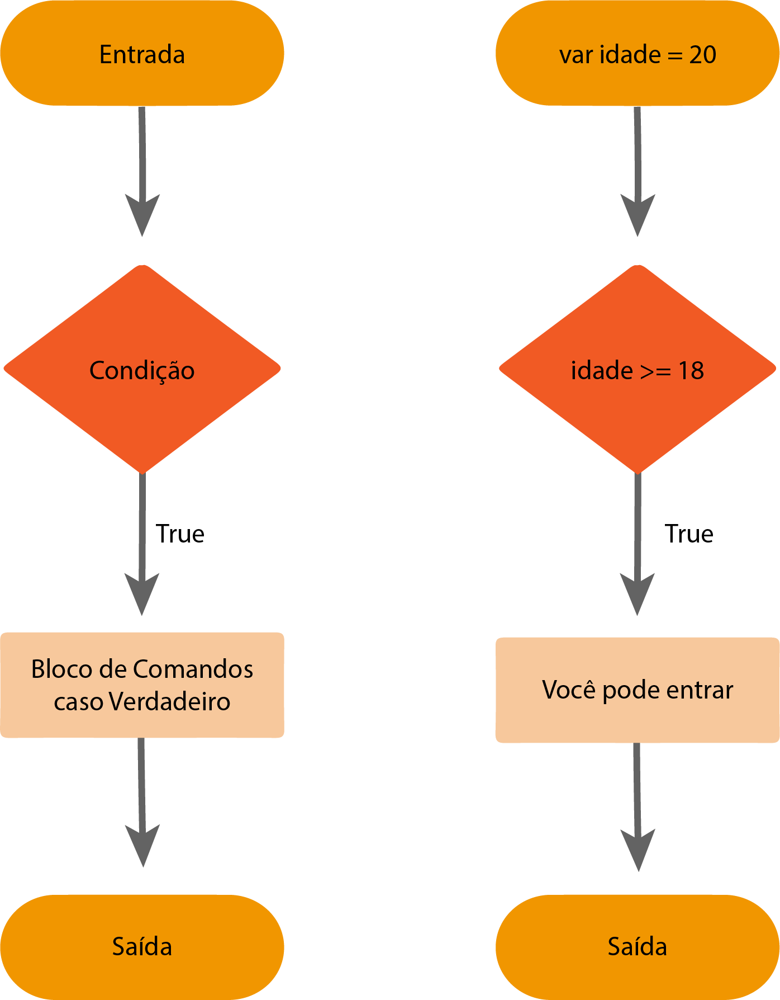
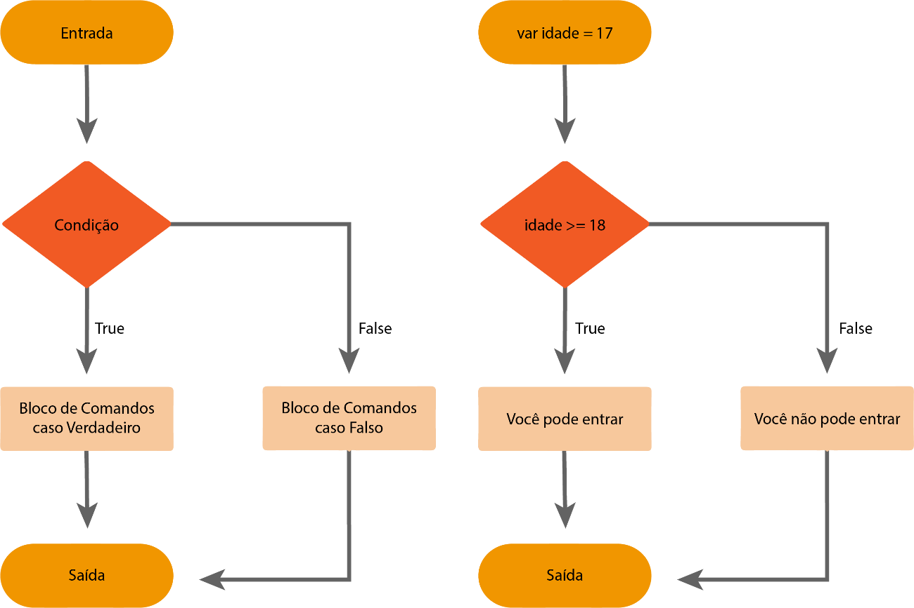
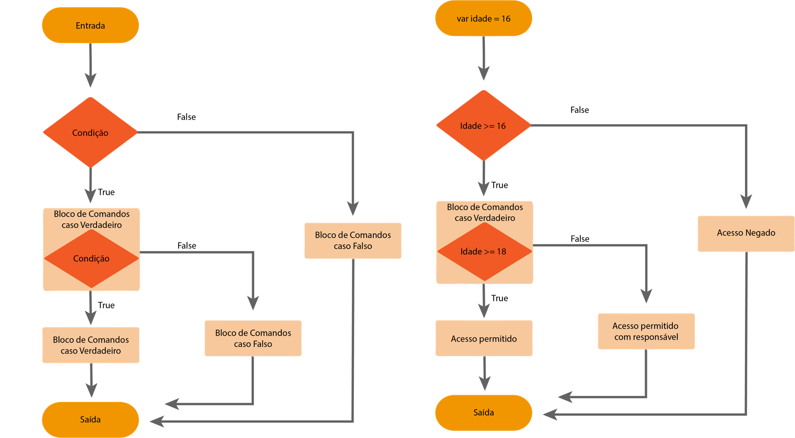

## Comando IF

Neste segundo post falaremos um pouco sobre as estruturas condicionais, as vezes precisamos executar uma ação somente se uma condição for verdadeira, no Swift isso é representado pela instrução if. Você informa uma condição pro Swift verificar e um trecho de código a ser executado caso a condição seja válida.

Vamos exemplificar e aprender a sintaxe do comando if:



Sintaxe:

```
    if  condicao  {
        //Código a ser executado caso a condição seja verdadeira
    }
```

```
    var estaSol: Bool = true

    if estaSol {
        print("O sol está visível")  
    }
```

Output:

```
    O sol está visível
```

No nosso exemplo nossa mensagem só é impressa porque nossa condição é verdadeira. No if podemos utilizar operadores lógicos e aritméticos. Para ambos a regra é a mesma, se a expressão for verdadeira, o trecho de código daquele if será executado. Vamos a mais alguns exemplos pra fixação da sintaxe:

```
    var estaSol: Bool = true
    var estaChovendo: Bool = true
    var estaNublado: Bool = false
    var descricaoTempo: String = "Ensolarado"


    if estaSol {
    print("O sol está visível")  
    }

    //Operador AND
    if  estaSol && estaChovendo {
    print("Chuva & Sol...")  
    }

    //Operador NOT
    if !estaNublado {
    print("Opa, parece que está nublado sim! - Nesse caso o estaNublado (false), foi negado.")  
    }

    //Operador OR
    if estaSol || estaChovendo {
    print("Opa, parece que está sol ou está chovendo")  
    }

    //Comparações
    if 5 > 1 {
    print("Sim! Cinco é maior que um.")  
    }


    //Comparações
    if descricaoTempo == "Ensolarado" {
    print("Sim! O tempo está ensolarado.")  
    }
```

Output:

```
    O sol está visível
    Chuva & Sol...
    Opa, parece que está nublado sim! - Nesse caso o estaNublado (false), foi negado.
    Opa, parece que está sol ou está chovendo
    Sim! Cinco é maior que um.
    Sim! O tempo está ensolarado.
```

Apenas como exemplo, vejamos algumas condições falsas:

```
    var estaSol: Bool = false
    var estaChovendo: Bool = false
    var estaNublado: Bool = true
    var descricaoTempo: String = "Chuvoso"


    if estaSol {
    print("O sol está visível")  
    }

    //Operador AND
    if estaSol && estaChovendo {
    print("Chuva & Sol...")  
    }

    //Operador OR
    if estaSol || estaChovendo {
    print("Opa, parece que está sol ou está chovendo")  
    }

    //Comparações
    if 5 > 10 {
    print("Sim! Cinco é maior que dez.")  
    }

    //Comparações
    if descricaoTempo == "Ensolarado" {
    print("Sim! O tempo está ensolarado.")  
    }
```

Output:

```
    main.swift:23:9: warning: will never be executed
    print("Sim! Cinco é maior que dez.")  
    main.swift:22:6: note: condition always evaluates to false
    if 5 > 10 {
        ^
```

Nada foi impresso pois nossas condições não eram verdadeiras, mas isso também pode ser útil não pode? Vamos conhecer o comando que complementa o nosso if, o else.

### Comando IF-ELSE

Opcionalmente podemos adicionar um segundo bloco chamado de else, este será encarregado de nos prover um bloco que só será executado caso a nossa condição não seja verdadeira.  No exemplo abaixo sairíamos pelo fluxo false na condicional.



Sintaxe:

```
    if condicao {
        //Código a ser executado caso a condição seja verdadeira
    } else {
        //Código a ser executado caso a condição não seja verdadeira
    }
```

```
    var estaSol: Bool = false

    if estaSol {
        print("O sol está visível")  
    }else{
        print("O sol não está visível")  
    }
```

Output: 

```
    O sol não está visível
```

Vamos ver mais exemplos com diferentes expressões condicionais:

```
    var estaSol: Bool = false
    var estaChovendo: Bool = false
    var estaNublado: Bool = true
    var descricaoTempo: String = "Chuvoso"


    if estaSol {
        print("O sol está visível")  
    }else{
        print("O sol não está visível")  
    }

    //Operador AND
    if estaSol && estaChovendo {
        print("Chuva & Sol...")  
    } else {
        print("Não temos Chuva & Sol hoje :(") 
    }

    //Operador OR
    if estaSol || estaChovendo {
        print("Opa, parece que está sol ou está chovendo")  
    } else {
        print("Opa, parece que não está sol ou não está chovendo")      
    }

    //Comparações
    if 5 > 10 {
        print("Com essa condição nunca entraremos aqui não é mesmo? ")  
    } else {
        print("Não! Cinco não é maior que dez.")  
    }

    //Comparações
    if descricaoTempo == "Ensolarado" {
        print("Sim! O tempo está ensolarado.")  
    } else {
        print("Não o tempo não está Ensolarado hoje! O tempo está \(descricaoTempo).")  
    }
```

Output:

```
    O sol não está visível
    Não temos Chuva & Sol hoje :(
    Opa, parece que não está sol ou não está chovendo
    Não! Cinco não é maior que dez.
    Não o tempo não está Ensolarado hoje! O tempo está Chuvoso.
```

### Comando IF - ELSE IF - ELSE

Isso ainda pode ficar mais interessante! E se quisermos testar mais de uma condição? No nosso cenário anterior sempre será executado um dos dois trechos, mas poderíamos testar mais uma condição dentro de um bloco true, ou de um bloco false (sim, é permitido encadear if). Vamos ver como ficaria?



No exemplo acima temos um controle de idade, a partir de 18 podem entrar, a partir de 16 entram acompanhados de um responsável, e abaixo disso o acesso é negado, vamos ver no Swift?

```
    var idade: Int = 16

    if idade >= 16 {
        if idade > 18 {
            print ("Acesso permitido")
        }else{
            print ("Acesso permitido com responsável")
        }
    } else{
        print ("Acesso negado")
    }
```

Output:

```
    Acesso permitido com responsável
```

Tudo tranquilo né? Vamos trabalhar com temperaturas e aprender mais uma possibilidade, para agregar ainda mais nossos conhecimentos sobre condicionais? Olhem o exemplo abaixo:

```
    var temp = 13

    if temp <= 12 {
        print("Está muito frio")
    } else {
        print("Oba deu praia!")
    }
```

Output:

```
    Oba deu praia!
```

Como nosso código só verifica uma condição, da forma que foi estruturado ele nos diz que deu praia, com 13 graus? Meio frio né? E se pudéssemos tratar diferentes faixas de temperatura? Vamos conhecer o else if, ele funciona também dentro da estrutura padrão do if, vejamos:

Sintaxe:

```
    if condicao {
        //Código a ser executado caso a primeira condição seja verdadeira
    } else if condicao {
        //Código a ser executado caso a segunda condição seja verdadeira
    } else {
        //Código a ser executado caso nenhuma condição não seja verdadeira
    }
```

```
    var temp = 13

    if temp <= 12 {
        print("Está muito frio")
    } else if temp <= 20 {
        print("Acho que podemos pegar o casaco!")
    } else {
        print("Oba deu praia!")
    }
```

Output:

```
    Acho que podemos pegar o casaco!
```

### Comando SWITCH

O switch é uma forma de não entrarmos em grandes estruturas de if encadeadas e complexas. Ou seja, a lógica é a mesma do if, diante de uma condição faça algo, mas o que o diferencia e possibilita que seja menos complexo? Vamos a sintaxe e alguns exemplos:

```
    switch variavel/constante {
        case condicao1:
            //Código a ser executado caso condicao1 seja verdadeira (No caso a condição padrão é ==, ou seja, ele irá comparar os dois valores)
        case condicao2:
            //Código a ser executado caso condicao2 seja verdadeira (No caso a condição padrão é ==, ou seja, ele irá comparar os dois valores)
        default:
            //Código a ser executado caso nenhuma condicao1 seja verdadeira
    }
```

💡 Podemos adicionar quantos cases forem necessários!

Vejam os 2 exemplos a seguir:

```
    let num = 8
 
    switch num {
        case 0:
            print("Num tem o valor 0")
        case 1:
            print("Num tem o valor 1")
        default:
            print("Num tem outro valor diferente de 0 e 1")
    }
```

Output:

```
    Num tem outro valor diferente de 0 e 1
```

```
    let favoriteColor = "black"
 
    switch favoriteColor {
        case "blue":
            print("minha cor predileta é Azul")
        case "black":
            print("minha cor predileta é Preto")
        case "red":
            print("minha cor predileta é Vermelho")
        default:
            print("Não temos registro pra cor informada.")
    }
```

Output:

```
    minha cor predileta é Preto
```

Então com um apenas um switch podemos verificar quantas condições quisermos para um valor informado no início dele. 

💡 Uma vez encontrado um valor correspondente ele saí da estrutura e não faz mais nenhuma verificação.

Vamos aprender novos operadores? Vamos ver no próximo exemplo operadores de intervalo!

```
    let reais = 10
 
    switch reais {
        case 0..<5:
            print("O preço está entre 0 e 4 reais.")
        case 5...10:
            print("O preço está entre 5 reais e 10 reais.")
        default:
            print("O preço é maior que 10 reais.")
    }
```

Output:

```
    O preço está entre 5 reais e 10 reais.
```

Agora que já viram aplicado vamos às definições:

1. A ..< B  | É utilizado para definir um intervalo entre um numero A e B excluindo B.
2. A ... B  | É utilizado para definir um intervalo entre um numero A e B incluindo B.

Exemplos:

2 ..< 8 - Está entre 2 e 7
0 ... 100 - Está entre 0 e 100

